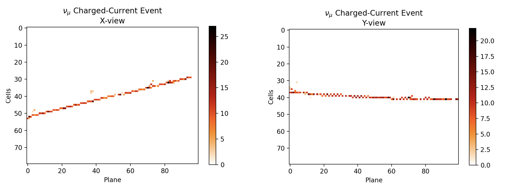
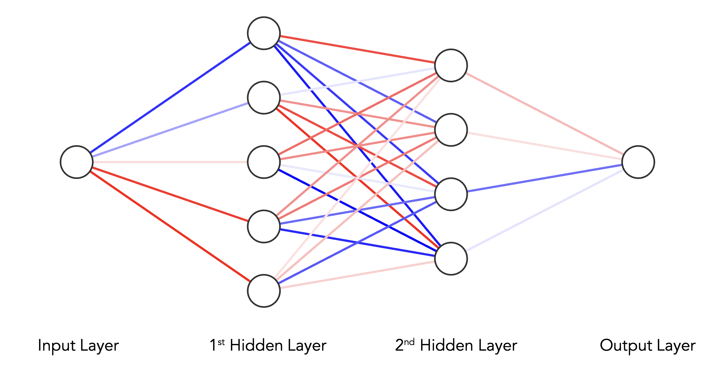
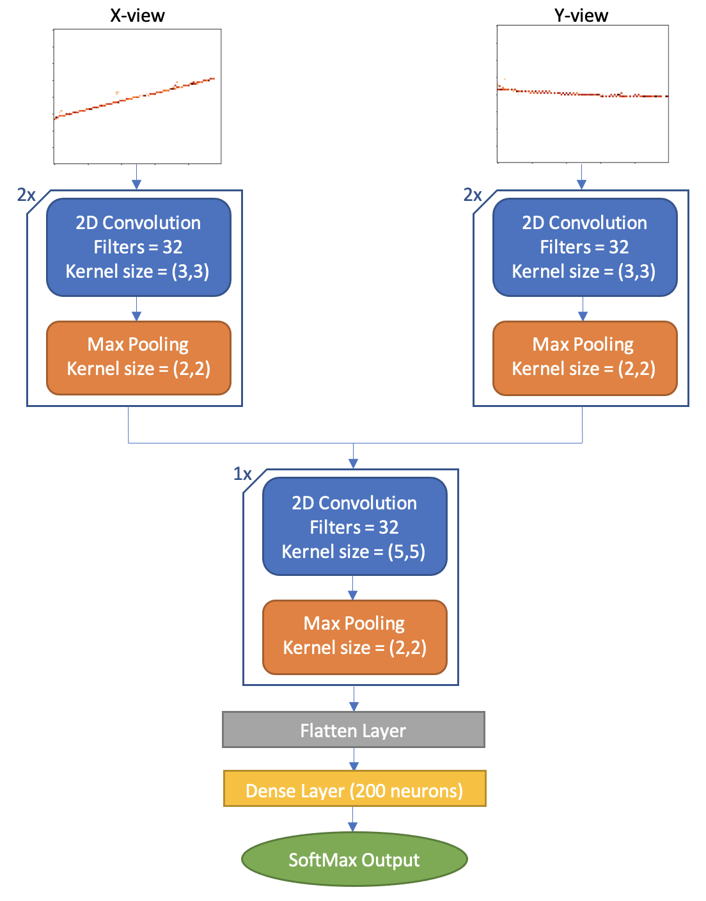
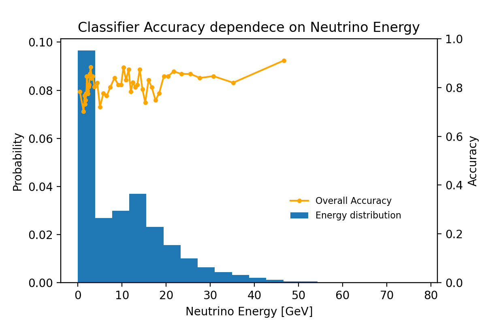
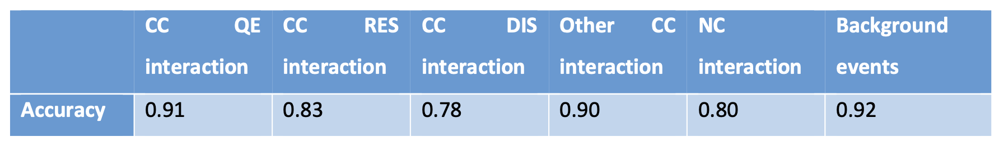

# Classification of Neutrino Interactions with Convolutional Neural Networks

This repository hosts the Jupyter Notebook and the PDF Project Report for my the project on the *Classification of Neutrino Interactions with Convolutional Neural Networks*. This project was my final submission to the *Machine Learning for Physicists* course at University College London (UCL) during Term 1 of 2021.

Following is a brief overview of the more detailed [project report](/ProjectReport.pdf).

### Introduction:
The project report delves into the challenge of classifying neutrino interactions in high-energy particle physics, particularly for the Fermilab's NOvA experiment. It focuses on understanding neutrino oscillations and the behavior of electron neutrinos (ν_e), muon neutrinos (ν_μ), and tau neutrinos (ν_τ). The study utilizes simulated images from NOvA's detectors and aims to develop a machine learning classifier to identify ν_μ charged-current events. The classifier's efficiency is evaluated against various parameters, such as neutrino energy and interaction type.

    

### Machine Learning and Neural Networks:
Deep Learning, a subset of Machine Learning, is employed to create neural networks, including convolutional neural networks (CNNs), for this task. The report outlines the basic structure and function of neural networks, emphasizing the importance of activation functions like ReLU and Sigmoid. The neural network model used in this study consists of an input layer, hidden layers, and an output layer, each with its unique functionality.

    

### CNN Structure for Neutrino Classification:
The CNN classifier is designed to process simulated neutrino interaction images, applying convolutional and pooling layers for feature extraction and dimensionality reduction. The model's architecture is tailored to classify ν_μ charged-current events, incorporating layers that process both X-view and Y-view images of neutrino interactions.

    

## Application and Performance:
The CNN classifier is tested on a dataset of simulated neutrino interactions. The model's performance is evaluated based on accuracy and the ability to identify true negatives, addressing the challenge of dataset imbalance. The classifier demonstrates varying accuracy levels based on interaction type and lepton energy involved in the neutrino interactions.

The classifier's dependency on metavariables like neutrino and lepton energy is explored. The report highlights the consistency of the model across a range of neutrino energies and its increased accuracy for interactions involving higher lepton energies.

    

The CNN classifier effectively identifies ν_μ charged-current events with a notable overall accuracy. The study illustrates the potential of Deep Learning in high-energy particle physics, particularly in classifying complex neutrino interactions. Future improvements could include expanding the training dataset to encompass a broader range of interaction types and energies.

    

### References:
See [PDF report](/ProjectReport.pdf) for the full list of references